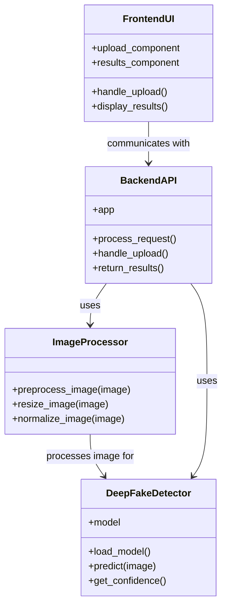

```mermaid
classDiagram
    class ImageProcessor {
        +preprocess_image(image)
        +resize_image(image)
        +normalize_image(image)
    }

    class DeepFakeDetector {
        +model
        +load_model()
        +predict(image)
        +get_confidence()
    }

    class BackendAPI {
        +app
        +process_request()
        +handle_upload()
        +return_results()
    }

    class FrontendUI {
        +upload_component
        +results_component
        +handle_upload()
        +display_results()
    }

    ImageProcessor --> DeepFakeDetector : processes image for
    BackendAPI --> ImageProcessor : uses
    BackendAPI --> DeepFakeDetector : uses
    FrontendUI --> BackendAPI : communicates with
```
