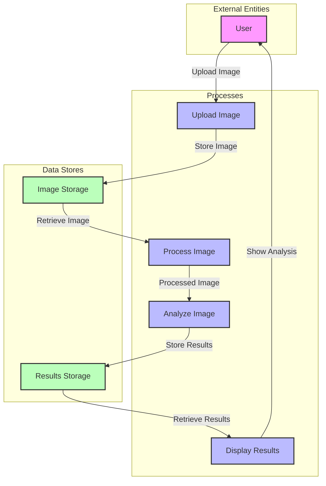

```mermaid
flowchart TD
    subgraph "External Entities"
        User[User]
    end

    subgraph "Processes"
        Upload[Upload Image]
        Process[Process Image]
        Analyze[Analyze Image]
        Display[Display Results]
    end

    subgraph "Data Stores"
        ImageStore[Image Storage]
        ResultsStore[Results Storage]
    end

    User -->|Upload Image| Upload
    Upload -->|Store Image| ImageStore
    ImageStore -->|Retrieve Image| Process
    Process -->|Processed Image| Analyze
    Analyze -->|Store Results| ResultsStore
    ResultsStore -->|Retrieve Results| Display
    Display -->|Show Analysis| User

    style User fill:#f9f,stroke:#333,stroke-width:2px
    style Upload fill:#bbf,stroke:#333,stroke-width:2px
    style Process fill:#bbf,stroke:#333,stroke-width:2px
    style Analyze fill:#bbf,stroke:#333,stroke-width:2px
    style Display fill:#bbf,stroke:#333,stroke-width:2px
    style ImageStore fill:#bfb,stroke:#333,stroke-width:2px
    style ResultsStore fill:#bfb,stroke:#333,stroke-width:2px
```
