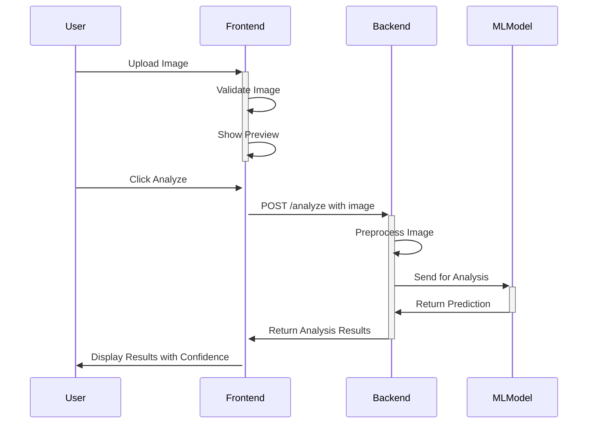

```mermaid
sequenceDiagram
    participant User
    participant Frontend
    participant Backend
    participant MLModel

    User->>+Frontend: Upload Image
    Frontend->>Frontend: Validate Image
    Frontend->>-Frontend: Show Preview

    User->>+Frontend: Click Analyze
    Frontend->>+Backend: POST /analyze with image
    Backend->>Backend: Preprocess Image

    Backend->>+MLModel: Send for Analysis
    MLModel->>-Backend: Return Prediction

    Backend->>-Frontend: Return Analysis Results
    Frontend->>User: Display Results with Confidence
```
