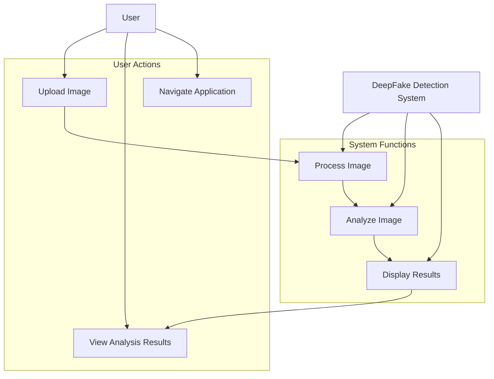

```mermaid
graph TD
    User[User] --> Upload[Upload Image]
    User --> ViewResults[View Analysis Results]
    User --> Navigate[Navigate Application]

    System[DeepFake Detection System] --> Process[Process Image]
    System --> Analyze[Analyze Image]
    System --> Display[Display Results]

    Upload --> Process
    Process --> Analyze
    Analyze --> Display
    Display --> ViewResults

    subgraph "User Actions"
        Upload
        ViewResults
        Navigate
    end

    subgraph "System Functions"
        Process
        Analyze
        Display
    end
```
